  
  <h1>Aviral Joshi</h1>
  
Computer Science undergrad at <b>IIIT Nagpur</b> &bull; Head of Technical Operations at <b>Elevate</b>

  

    
    &nbsp;
    
    &nbsp;
    
  

 

## 👋 About me

- 🎓 2nd year B.Tech in Computer Science at **IIIT Nagpur**
- 🛠️ Head of Technical Operations at **Elevate**
- 💻 Focus on backend engineering, systems, and developer tooling
- 🎧 Music production and weightlifting away from the keyboard

 

## 🧰 What I work with

| Area | Focus | Tools |
| :--- | :--- | :--- |
| **Systems** | High-performance code, memory efficiency, algorithm design |    |
| **Full-stack** | Scalable architecture, reactive UI, API design |     |
| **Infrastructure** | Storage layers, caching, containerized services |     |

 

## 🔥 Projects

| Project | What it is | Stack | Status |
| :--- | :--- | :--- | :--- |
| [**3D UPLIN (SIH)**](https://github.com/adiscripts03/3D_UPLIN_SIH) | Geospatial and 3D digital twin | `Python` · `Three.js` · `Unity` · `Spatial AI` | 🟢 Completed |
| [**LLM Gateway**](https://github.com/aviraL27/llm-gateway) | AI routing and orchestration proxy | `Node.js` · `TypeScript` · `Redis` · `Docker` | 🚀 Active deployment |
| [**Analysis Platform**](https://github.com/aviraL27/analysis-platform) | High-volume telemetry and analytics | `React` · `TypeScript` · `PostgreSQL` · `FastAPI` | 🛰️ In production |
| [**Nyaya AI**](https://github.com/adiscripts03/NYAYA_AI) | Legal intelligence and semantic search | `Python` · `FastAPI` · `LangChain` · `Vector DB` | 🟢 Completed |
| [**Jal Setu GIS**](https://github.com/adiscripts03/JAL-SETU-GIS) | IoT and water resource telemetry | `GIS` · `PostGIS` · `Node.js` · `React` | 🛰️ Operational |
| [**KisaanBazar**](https://github.com/aviraL27/KisaanBazar) | Agri-tech real-time marketplace | `React` · `Express` · `MongoDB` · `WebSockets` | 📦 Archived |

 

## 📈 GitHub stats

  
  &nbsp;
  
    
  

 

## 🐍 Contribution activity

  

 

---

 

  
    
  

