<!-- CYBER-GALAXY AGENT CONSOLE // AVIRAL JOSHI -->
<p align="center">
  
</p>

<p align="center">
  <a href="https://discord.com/users/460646619805646849">
    
  </a>
  &nbsp;
  <a href="https://www.linkedin.com/in/aviral-joshi-a98a67373/">
    
  </a>
  &nbsp;
  <a href="mailto:aviral270406@gmail.com">
    
  </a>
  &nbsp;
  <a href="https://github.com/aviraL27">
    
  </a>
</p>

<br/>

<!-- MISSION TELEMETRY HUD -->
<p align="center">
  
</p>

<br/>

## 🛰️ `// 01. OPERATOR DIAGNOSTIC`

```yaml
operator: Aviral Joshi
identifier: aviraL27
current_orbit: Indian Institute of Information Technology Nagpur (IIITN)
degree: B.Tech in Computer Science and Engineering (2nd Year)
appointment: Head of Technical Operations @ Elevate
mission_creed: "Architecting high-throughput distributed systems, modern AI tooling, and low-level protocols."
off_duty_payload: [Music Production, Heavy Weightlifting, Sound Engineering]
```

<details>
<summary><strong>✦ Read Extended Operator Log</strong></summary>
<br/>

I am a Computer Science undergraduate focused on systems programming, scalable backend engineering, and intelligent autonomous software. As **Head of Technical Operations at Elevate**, I lead technical infrastructure, automate developer workflows, and ensure reliable execution across our systems.

When I'm away from the keyboard, you'll find me analyzing complex sound designs, composing music, or pushing limits in the gym.
</details>

<br/>

## 🌌 `// 02. GALAXY ARMS & CAPABILITIES`

<p align="center">
  
</p>

| Galaxy Sector | Architectural Focus | Arsenal & Technologies |
| :--- | :--- | :--- |
| **Arm 01 · Core Propulsion** | High-performance systems, memory efficiency, algorithm design |    |
| **Arm 02 · Orbital Interface** | Scalable full-stack architecture, reactive UI, and API orchestration |     |
| **Arm 03 · Deep Space Infra** | Resilient storage layers, distributed caching, and microservice containers |     |

<br/>

## 🪐 `// 03. ACTIVE CONSTELLATIONS (FEATURED MISSIONS)`

| Mission System | Domain / Orbit | Core Stack | Operational Status |
| :--- | :--- | :--- | :--- |
| [**3D UPLIN (SIH)**](https://github.com/adiscripts03/3D_UPLIN_SIH) | Geospatial &amp; 3D Digital Twin | `Python` · `Three.js` · `Unity` · `Spatial AI` | `🟢 SIH National Finalist` |
| [**LLM Gateway**](https://github.com/aviraL27/llm-gateway) | AI Routing &amp; Orchestration Proxy | `Node.js` · `TypeScript` · `Redis` · `Docker` | `🚀 Active Deployment` |
| [**Analysis Platform**](https://github.com/aviraL27/analysis-platform) | High-Volume Telemetry &amp; Analytics | `React` · `TypeScript` · `PostgreSQL` · `FastAPI` | `🛰️ Production Orbit` |
| [**Nyaya AI**](https://github.com/adiscripts03/NYAYA_AI) | Legal Intelligence &amp; Semantic Search | `Python` · `FastAPI` · `LangChain` · `Vector DB` | `🟢 Mission Accomplished` |
| [**Jal Setu GIS**](https://github.com/adiscripts03/JAL-SETU-GIS) | IoT &amp; Water Resource Telemetry | `GIS` · `PostGIS` · `Node.js` · `React` | `🛰️ Operational` |
| [**KisaanBazar**](https://github.com/aviraL27/KisaanBazar) | Agri-Tech Real-time Marketplace | `React` · `Express` · `MongoDB` · `WebSockets` | `📦 Archived Release` |

<br/>

## 📊 `// 04. LIVE TELEMETRY & SATELLITE METRICS`

<p align="center">
  
  &nbsp;&nbsp;
  
</p>

<p align="center">
  
</p>

<br/>

## 🎮 `// 05. CELESTIAL ORBIT GRID (CONTRIBUTIONS)`

<p align="center">
  <picture>
    <source media="(prefers-color-scheme: dark)" srcset="https://raw.githubusercontent.com/aviraL27/aviraL27/output/github-contribution-grid-snake-dark.svg">
    <source media="(prefers-color-scheme: light)" srcset="https://raw.githubusercontent.com/aviraL27/aviraL27/output/github-contribution-grid-snake.svg">
    
  </picture>
</p>

<br/>

---

<p align="center">
  
</p>

<p align="center">
  <code>[TRANSMISSION END] · AVIRAL JOSHI · ALL SYSTEMS NOMINAL</code>
</p>
